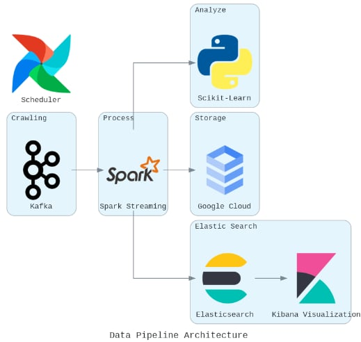

# Group 3 - Problem 3 - IT4043E
---
- [Group 3 - Problem 3 - IT4043E](#group-5---problem-4-profiler---it4043e)
  - [Introduction](#introduction)
  - [Project Structure](#project-structure)
  - [Architecture](#architecture)
  - [Prerequisite](#prerequisite)
  - [Setup](#Setup)
  - [Kibana Dashboard](#kibana-dashboard)
  - [Data Structures](#data-structures)
  - [Airflow DAGs](#airflow-dags)
      - [Kafka Jobs DAG](#kafka-jobs-dag)
      - [Batch Layer DAG](#batch-layer-dag)
      - [Speed Layer DAG](#speed-layer-dag)
  - [Report](#report)
  - [Contact](#for-more-information)


## Introduction
Collected social data need to be monitored to evaluate the quantity and quality which enable us to do these things below:
- Establish an optimized storage mechanism to augment server performance.
- Log and promptly alert concerning any irregular or noteworthy events.

This project aims to:
- Gather data from Twitter, utilizing either the Twitter API or web scraping techniques.
- Evaluate project quality and Key Opinion Leaders (KoLs) based on key social network metrics, including posting frequency, impression counts, and engagement levels.
- Create visual representations of the analyzed data.

## Project Structure
```bash
.
├── airflow_dags
│   ├── __init__.py
│   └── twitter_daily_dag.py
├── config.yaml
├── data
├── DataDoc.pdf
├── images
│   └── pipelinepipeline.jpeg
├── jars
│   ├── elasticsearch-spark-30_2.12-8.9.1.jar
│   └── gcs-connector-hadoop3-latest.jar
├── kafka_jobs
│   ├── consumer
│   │   ├── elasticsearch_consumer.py
│   │   └── gcs_consumer.py
│   ├── create_topic.sh
│   ├── __init__.py
│   └── twitter_producer.py
├── keys
│   ├── infra.json
│   ├── lucky-wall-393304-2a6a3df38253.json
│   └── lucky-wall-393304-3fbad5f3943c.json
├── LICENSE
├── logger
│   ├── __init__.py
│   └── logger.py
├── logs
├── modelling
│   └── ML_models.py
├── README.md
├── requirement.txt
├── test
│   ├── __init__.py
│   ├── test_data_processing.py
│   ├── test_gcb.py
│   ├── test_kafka.py
│   └── test_logger.py
├── test.ipynb
├── test.txt
├── twitter_crawler
│   ├── followers_crawler.py
│   ├── __init__.py
│   ├── tweet_kol_crawler_v2.py
│   ├── twitter_daily.py
│   ├── user_update_crawler.py
│   └── utils.py
└── utils.py
```

## Architecture



## Prerequisite
* Python >= 3.10
* Airflow >= 2.7.3
* Linux OS

## Setup
1. **Environment Variables File**
   * Create a `.env` file
   * Adjust values and credentials in `.env`

2. **Python Environment**
    ```
    pip install -r src/requirements.txt 
    ```
    You can also create an conda environment to install required packages

3. **Run Airflow**
   * Please follow [this article](https://medium.com/geekculture/apache-airflow-2-0-complete-installation-with-wsl-explained-71a65d509aba) to install Airflow.

   * Change necessary paths in dag scripts (dags/logs/plugins folder).

   * To run Airflow:

   ```
   airflow webserver &
   airflow scheduler &
   ```

## Kibana Dashboard

**General Dashboard**


**Account Dashboard**


## Data Structures 
Please see the data structure in 